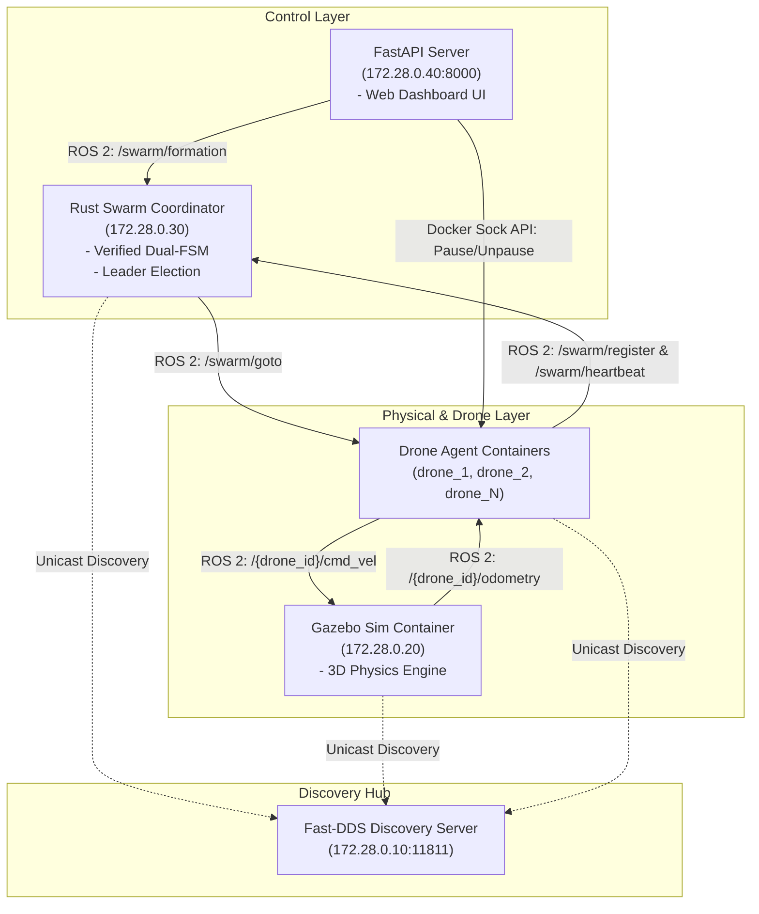
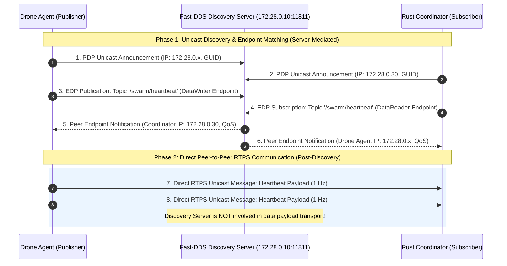

# IIoT Drone Swarm Coordinator with Verified Rust FSM & ROS 2

A distributed and highly resilient swarm coordination system for IIoT (*Industrial Internet of Things*) drones, built in **Rust** and **ROS 2 Jazzy**, integrated with the **Gazebo Sim** 3D simulator, and formally verified using the **Kani** model checker.

The project features a Web Observability & Control Dashboard built with **FastAPI**, enabling real-time monitoring of the drone swarm, triggering geometric flight formations, and simulating drone agent failures and repairs within a containerized **Docker Compose** environment.

---

## Table of Contents
- [What is the Project](#what-is-the-project)
- [Technologies Used](#technologies-used)
- [System Architecture](#system-architecture)
  - [Dual Finite State Machines (Dual FSM)](#dual-finite-state-machines-dual-fsm)
  - [Formal Verification with Kani](#formal-verification-with-kani)
  - [Leader Election & Dynamic Formation Algorithm](#leader-election--dynamic-formation-algorithm)
  - [3D Obstacle Avoidance (APF & Layering)](#3d-obstacle-avoidance-apf--layering)
- [System Requirements](#system-requirements)
- [How to Launch the Simulation](#how-to-launch-the-simulation)
  - [1. X11 Display Configuration (for Gazebo GUI)](#1-x11-display-configuration-for-gazebo-gui)
  - [2. Launching Docker Containers](#2-launching-docker-containers)
  - [3. Opening the Web Dashboard](#3-opening-the-web-dashboard)
- [How to Run the Simulation (Step-by-Step)](#how-to-run-the-simulation-step-by-step)
  - [A. Triggering Line Formation](#a-triggering-line-formation)
  - [B. Simulating Drone Failure (Pause Container)](#b-simulating-drone-failure-pause-container)
  - [C. Simulating Drone Repair (Unpause Container)](#c-simulating-drone-repair-unpause-container)
- [How to Teardown & Stop Everything](#how-to-teardown--stop-everything)
- [Theoretical Background](#theoretical-background)
  - [1. Data Distribution Service (DDS) & Fast-DDS](#1-data-distribution-service-dds--fast-dds)
    - [Fast-DDS Discovery Protocol & Step-by-Step Sequence](#fast-dds-discovery-protocol--step-by-step-sequence)
    - [Architectural Decision: Docker Bridge + Discovery Server vs. Macvlan](#architectural-decision-docker-bridge--discovery-server-vs-macvlan)

---

## What is the Project

This project implements a full end-to-end autonomous coordination solution for industrial IIoT drone swarms. The swarm capability set includes:
1. **Dynamic Registration**: Automatic onboarding of new drones entering the ROS 2 graph.
2. **Autonomous Leader Election**: Spatial density & proximity-driven election algorithm (Bully-variant) to reduce collisions.
3. **Health Telemetry & FSM Tracking**: Heartbeat monitoring with multi-tier timeout handling (5s Suspected, 10s Failed).
4. **Complex Flight Formations**: Synchronized formation maneuvers (e.g., *Line Formation*) centered around the elected Leader.
5. **3D Flight Safety**: Collision avoidance using Artificial Potential Fields (APF) and altitude layering.
6. **Fault Tolerance**: Instant re-election of a new Leader upon failure or disconnection, real-time mid-flight formation adjustment (*Ripple Shift*), and seamless re-integration of repaired drones.

---

## Technologies Used

| Component | Technology | Description |
| :--- | :--- | :--- |
| **Core Coordinator** | **Rust** (`std::thread`, Serde) | Multithreaded, high-performance, resilient swarm coordinator core. |
| **Formal Verification** | **Kani Rust Model Checker** | Proof harnesses verifying safety invariants of the dual FSM logic. |
| **Middleware & Messaging** | **ROS 2 Jazzy Jalisco** | Inter-process & container communication via ROS 2 pub/sub topics. |
| **DDS Discovery** | **Fast-DDS Discovery Server** | Unicast DDS discovery (UDP/TCP port 11811) overcoming Docker multicast limits. |
| **3D Simulation** | **Gazebo Sim (Harmonic/Ignition)** | Physics-based 3D simulator rendering quadcopter drones (X3 UAV models). |
| **Drone Agent Controller** | **Python 3** (`rclpy`) | Onboard agent node with 20 Hz P-Controller & 3D APF obstacle avoidance. |
| **Observability Backend** | **Python** (**FastAPI**, Docker SDK) | REST API backend inspecting container status and executing Docker management tasks. |
| **Frontend Dashboard** | **HTML5 / CSS3 / Vanilla JS** | Real-time web user interface for swarm status tracking and interactive control. |
| **Containerization** | **Docker & Docker Compose** | Microservices architecture supporting dynamic scaling (`docker compose up --scale drone=N`). |

---

## System Architecture

The architecture consists of isolated microservices connected via a dedicated Docker bridge network (`swarm_net`: `172.28.0.0/16`).



### Dual Finite State Machines (Dual FSM)

Every drone in the swarm is represented by a dual-state tuple `(S1, S2)` maintained by the Rust coordinator:

- **FSM 1 (Health State - S1)**:
  - `Unregistered`: Drone newly spawned or initializing.
  - `Active`: Operational drone emitting periodic heartbeats.
  - `Suspected`: No heartbeat received for over **5 seconds**.
  - `Failed`: No heartbeat received for over **10 seconds** (drone considered crashed/offline).
- **FSM 2 (Swarm Role - S2)**:
  - `None`: No role assigned (when S1 is `Unregistered` or `Failed`).
  - `Candidate`: Eligible to become Leader during an election process.
  - `Follower`: Gregarious drone following the Leader's trajectory and formation directives.
  - `Leader`: Active leader drone governing the swarm.

### Formal Verification with Kani

Located in the `Kani_verify/` directory, proof harnesses written for the **Kani** model checker mathematically verify the following safety invariants:
1. **Inactive Role Invariant**: An `Unregistered` or `Failed` drone must ALWAYS have S2 = `None`.
2. **Suspected Role Preservation**: Entering `Suspected` or recovering back to `Active` preserves the S2 role unchanged.
3. **Single Leader & Recovery Invariant**: In any valid swarm state, **at most one active Leader** exists. Upon Leader failure, re-election guarantees a single new Leader without violating the invariant when repaired drones rejoin.

### Leader Election & Dynamic Formation Algorithm

- **Density & Proximity Leader Election**: When the active Leader fails, the Rust coordinator inspects the vacant Y coordinate of the lost Leader and selects a replacement candidate based on wing density (left vs right side candidate count) to minimize total swarm movement.
- **Ripple Shift Re-Formation**: When a drone or Leader fails during active line formation, the swarm executes a sequential shift (*Ripple Shift*): drones on the opposite wing stay completely stationary, while drones on the affected side translate inward to fill the gap safely.

### 3D Obstacle Avoidance (APF & Layering)

- **3D Artificial Potential Fields (APF)**: Each drone agent computes a repulsive velocity vector once another drone is approaching to avoid collisions.
- **Directional Altitude Layering**: During formation reorganization, drones crossing paths adjust altitude (e.g., 4.8m vs 5.6m) to prevent mid-air collisions.

---

## System Requirements

- **Operating System**: Linux (Ubuntu 22.04 / 24.04 recommended).
- **Docker**: Docker Engine 20.10+ with permissions to run without `sudo` (user added to the `docker` group).
- **Docker Compose**: Docker Compose v2 (`docker compose`).
- **X11 Display Server**: Required for rendering the Gazebo 3D GUI window (`xhost` installed).
- **Recommended Hardware**: Quad-Core CPU+, 8 GB RAM.

---

## How to Launch the Simulation

### 1. X11 Display Configuration (for Gazebo GUI)

To allow the Gazebo Docker container to open its 3D GUI window on your Linux host display, run the following command in your terminal:

```bash
xhost +local:root
```

### 2. Launching Docker Containers

Navigate to the `Implementation/` directory and spin up the microservices, specifying the desired number of drones using `--scale drone=N` (for example, **3 drones**):

```bash
cd Implementation
docker compose up --build --scale drone=3
```

> **Note**: On first run, Docker will download base ROS 2 images and compile both the Rust coordinator and FastAPI server. Wait until all containers report healthy status in the terminal logs.

### 3. Opening the Web Dashboard

Once containers are running, open your web browser and navigate to:

```text
http://localhost:8000
```

---

## How to Run the Simulation (Step-by-Step)

### A. Triggering Line Formation

1. Open the Web Dashboard (`http://localhost:8000`). You will see the total drone count (e.g., 3 drones: `drone_1`, `drone_2`, `drone_3`), individual status cards, and the **Active Leader** indicator (e.g., `Leader: drone_1`).
2. In the **Swarm Controls** panel, click **"Trigger Line Formation"**.
3. **Observed Behavior**:
   - The Rust coordinator assigns target coordinates (X_C, Y_C, Z=4.0m) to the Leader and symmetric 2.0m-spaced targets along the Y-axis to Follower drones.
   - In the Gazebo 3D window, drones take off from the ground and align into a line formation centered around the Leader.

---

### B. Simulating Drone Failure (Pause Container)

1. On the Web Dashboard, locate the card for the **Leader** (or any other drone).
2. Click the **"Pause"** button on the target drone's card (e.g., `drone_1`).
3. **Observed Behavior**:
   - The Docker container is paused, simulating hardware failure or communication loss.
   - **Phase 1 (5s Timeout)**: After 5s without heartbeats, the drone's S1 state transitions from `Active` to `Suspected` (highlighted in orange/yellow).
   - **Phase 2 (10s Timeout)**: After 10s, S1 transitions to `Failed` (highlighted in red) and the drone is despawned from Gazebo.
   - **Re-election & Re-formation**: If the failed drone was the Leader, the `LeaderFailedReelectionTrigger` event fires. A new Leader is elected, and remaining drones execute a *Ripple Shift* to close the formation gap without collisions.

---

### C. Simulating Drone Repair (Unpause Container)

1. On the Web Dashboard, click **"Unpause"** next to the paused drone (e.g., `drone_1`).
2. **Observed Behavior**:
   - The drone container resumes operation.
   - The drone agent sends a registration request to the coordinator.
   - The coordinator triggers Event 6 (`RepairCompleted`): S1 transitions `Failed` to `Unregistered` to turn `Active` as a `Follower`.
   - **Automatic Re-integration**: The swarm detects the recovered drone and re-integrates it into the active formation, assigning it an outer slot.

---

## How to Teardown & Stop Everything

To stop all services, clean up Docker containers, networks, and volumes:

1. Press `Ctrl + C` in the terminal where Docker Compose is running.
2. Execute the teardown command inside `Implementation/`:

```bash
docker compose down
```

3. (Optional) To clean up named volumes (e.g., generated SDF model files):

```bash
docker compose down -v
```

4. Restore standard X11 display security rules on your host machine:

```bash
xhost -local:root
```

---

## Theoretical Background

### 1. Data Distribution Service (DDS) & Fast-DDS

#### What is DDS?
**Data Distribution Service (DDS)** is an Object Management Group (OMG) open standard for data-centric, real-time, peer-to-peer publish-subscribe middleware. Unlike traditional message-oriented middleware, DDS centers around data ("topics") rather than endpoints.

#### DDS vs. Traditional Client-Server Architecture
Traditional Client-Server architectures (such as HTTP/REST request-response) introduce major bottlenecks in real-time, multi-agent robotic systems. The table below outlines how DDS resolves key Client-Server limitations:

| Client-Server Limitation | Real-World Problem | How DDS Resolves It |
| :--- | :--- | :--- |
| **Single Point of Failure** | If the central server/broker crashes, the entire system halts instantly. | **Native Peer-to-Peer**: No central broker is required. If a node fails, remaining nodes continue communicating seamlessly. |
| **Bottlenecks (Latency & Bandwidth)** | All network traffic passes through a central server, causing severe congestion as data volume increases. | **Direct Communication**: Data flows directly from publisher to subscriber with zero intermediate hops, minimizing latency and maximizing throughput. |
| **Rigid Coupling** | Clients must know the exact IP address and port of the server to send or request data. | **Data-Centricity**: Nodes do not query *"Who are you?"*, but rather *"Who is interested in Topic X?"*. Nodes publish and receive data anonymously without knowing peer IP addresses. |
| **"All-or-Nothing" Service Management** | Managing different delivery requirements for distinct data flows over the same channel is difficult. | **Granular Quality of Service (QoS)**: Fine-grained rules can be configured per topic flow (e.g., reliability, durability, deadline, liveliness). |

#### What is Fast-DDS?
**Fast-DDS** (developed by eProsima) is a C++ implementation of the OMG DDS standard and the Real-Time Publish-Subscribe (RTPS) protocol. It is the default middleware implementation powering **ROS 2 Jazzy Jalisco**, providing low-latency, deterministic data exchange for robotic entities.

#### Why Fast-DDS Discovery Server in this Project?
By default, ROS 2 relies on **UDP Multicast** for dynamic peer discovery. However, containerized microservice architectures using Docker bridge networks frequently block or restrict UDP multicast packets across isolated containers.

To solve this problem, this project utilizes the **Fast-DDS Discovery Server** (running on port `11811`):
- It replaces multicast discovery with a **centralized unicast architecture**.
- Each drone agent and the Rust coordinator register directly with the Discovery Server upon container startup.
- This ensures deterministic, instant discovery of all ROS 2 nodes across Docker containers without packet loss or network isolation issues.

#### Fast-DDS Discovery Protocol & Step-by-Step Sequence

The Fast-DDS Discovery Server converts ROS 2 discovery into a two-phase process: **Server-Mediated Discovery** followed by **Direct Peer-to-Peer Data Communication**.

##### Step-by-Step Discovery Protocol Breakdown:

1. **Step 1: Participant Discovery Protocol (PDP)**
   - Upon container launch, each ROS 2 participant (`drone_1`, `coordinator`, `gazebo`) sends a unicast **PDP announcement** to the Discovery Server at `172.28.0.10:11811`.
   - The PDP payload contains node identity (GUID), container IP address, and supported transport capabilities.

2. **Step 2: Endpoint Discovery Protocol (EDP)**
   - Nodes declare their active ROS 2 topics to the Discovery Server.
   - For example, `drone_1` declares a *DataWriter* for topic `/swarm/heartbeat`, while `coordinator` declares a *DataReader* for the same topic along with their QoS parameters.

3. **Step 3: Server-Side Endpoint Matching & Relay**
   - The Discovery Server matches compatible *DataWriters* and *DataReaders* across the network.
   - The Discovery Server relays peer IP endpoints and port details directly to both participants.

4. **Step 4: Direct Peer-to-Peer (P2P) RTPS Data Transport (Post-Discovery)**
   - Once discovery matching completes, **the Discovery Server steps out of the data path**.
   - All high-frequency topic data (heartbeats, odometry, target coordinates, velocity commands) flows **directly peer-to-peer** between nodes over RTPS UDP unicast without passing through the Discovery Server.

##### Sequence Diagram: Discovery Phase vs. Post-Discovery P2P Communication




#### Architectural Decision: Docker Bridge + Discovery Server vs. Macvlan
When deploying containerized ROS 2 swarms, selecting the network driver involves critical trade-offs:

| Network Strategy | Architectural Complexity | Setup Overhead | Multicast Support | Decision |
| :--- | :--- | :--- | :--- | :--- |
| **Custom Macvlan Network** | **High**: Binds container virtual interfaces directly to host physical NICs, requiring subnet management and custom host-to-container routing rules. | **Complex & Time-Consuming**: Fragile, platform-dependent, and prone to host OS network collisions. | Native UDP Multicast enabled. | ❌ Discouraged due to excessive configuration overhead. |
| **Docker Bridge + Fast-DDS Discovery Server** | **Low**: Standard Docker bridge network (`swarm_net`) with isolated IP subnet allocation. | **Minimal & Deterministic**: Simply run the Discovery Server on port `11811` and inject `DISCOVERY_SERVER_IP=172.28.0.10` via environment variables. | Converted to Unicast TCP/UDP. | ✅ **Chosen Solution**: Seamless setup, portable, cross-platform, and highly reliable. |

**Rationale**: Manually configuring a `macvlan` driver solely to enable classical DDS UDP multicast discovery is time-consuming and fragile across different host operating systems. Leveraging a standard **Docker Bridge** network combined with the **Fast-DDS Discovery Server** provides a plug-and-play, deterministic, and highly portable architecture requiring zero host-level network modifications.
